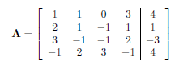

# metodoGauss
Uso do método de eliminação de Gauss para achar raízes de sistemas de equação lineares

# O método de eliminação de Gauss

É um procedimento usada para resolver sistemas de equações lineares. Ele consiste em aplicar sucessivas operações elementares num sistema de equações genericos até apresentar a forma *triangular superior*, que apresenta exatamente as mesmas soluções que o original, é então resolvida com emprego da substituição regressiva.

## Escalonamento de matrizes

Uma matriz completa, também chamada de matriz aumentada, está na forma escalonada quando satisfaz as seguintes condições:

* Todas as linhas não-nulas estão acima de qualquer linha composta só de zeros.
* O pivô de cada linha está numa coluna à direita do pivô da linha acima.
* Todos os elementos de uma coluna abaixo de um pivô são zero.

Exemplo


A forma escalonada pode ser obtida por operações elementares que seram listadas a seguir:

	* Trocar duas linhas entre si
	* Multiplicar os elementos de uma linha por uma constante não nula.
	* Substituir uma linha pela sua soma com um múltiplo de outra.

## Solução de um sistema de equações lineares 

Considere o seginte sistema linear **Ax = b** abaixo:


Nós o reduzimos a um sistema mais simples como segue.

**Passo 1:** Transponha equações de modo que a primeira incógnita x_1 tenha coeficiente não nulo nna primeira equação, isto é, de modo que a_11 ≠ 0, ou seja, obtenha a matriz completa do sistema.

**Passo 2 *eliminação de Gauss*: ** Transforme a matriz completa **[A|b]** em uma matriz aumetada **[Ā|b]** onde Ā é uma matriz triangular superior.
*Obtenção da matriz triangular superior:* para cada i > 1, aplique a operacão 
  


Isto é, substitua a *i*-ésima equação linear L_i pela equação obtida multiplicando a primeira equação L_1 por -a_i1, multiplicando a *i*-ésima equação L_i por a_11  e, então, somando.

**Passo 3:** Resolver o sistema linear pela substituição regressiva


# Codigo

``` c
#include <stdio.h>
#include <stdlib.h>

double *substituicaoRegressiva(double **m, size_t dim)
{
    double *root = (double*)malloc(dim * sizeof(double));
    double sum;
    int i,j,n;

    n = dim - 1;
    root[n] = m[n][dim]/(double)m[n][n];

    for(i = n - 1; i >= 0; i--)
    {
        sum = 0;

        for(j = i + 1; j <= n; j++ )
        {
            sum += m[i][j] * root[j];
            *operacao = *operacao + 1;
        }

        root[i] = (m[i][dim] - sum)/(double)m[i][i];
    }
    return root;
}

void triangularSuperior(double **m, size_t dim)
{
    int i,j,k;
    double n;

    for(i = 0; i < dim; i++)
    {
        for(j = i + 1; j < dim; j++)
        {
            n = m[j][i]/(double)m[i][i];

            for(k = 0; k < dim + 1; k++)
            {
                m[j][k] = m[j][k] - n * m[i][k];
            }
        }
    }
}

double **lerMatrizCompleta(const char *arg, size_t *dim)
{
    double **m;
    int i,j;

    FILE *arq = fopen(arg,"r");

    if(arq == NULL)
    {
        printf("arquivo nao encontrado\n");
        exit(1);
    }

    fscanf(arq,"%d",dim);

    m = (double**)malloc((*dim) * sizeof(double*));

    for(i = 0; i< *dim; i++)
    {
        m[i] = (double*)malloc((*dim + 1) * sizeof(double));
    }

    for(i = 0; i < *dim; i++)
    {
        for(j = 0; j < *dim + 1; j++)
        {
            fscanf(arq,"%lf", &m[i][j]);
        }
    }
    fclose(arq);
    return m;

}

void imprimeMatrizCompleta(double **m, size_t dim)
{
    int i,j;

    for(i = 0; i < dim; i++)
    {
        for(j = 0; j < dim + 1; j++)
        {
            (j == dim)? printf("| %5.2lf\t",m[i][j]): printf("%5.2lf\t",m[i][j]);
        }
        puts("");
    }
    puts("________");
}

void imprimeRaiz(double *r, size_t dim)
{
    int i;

    puts("\n__roots__\n");

    for(i = 0; i < dim; i++)
    {
        printf("x[%d] = %6.3lf\n",i + 1,r[i]);
    }

    puts("________");
}

int main(int argc, char **argv)
{
    double **matriz;
    double *root;
    size_t dim;

    matriz = lerMatrizCompleta(argv[1],&dim);
    imprimeMatrizCompleta(matriz,dim);
    triangularSuperior(matriz,dim);
    imprimeMatrizCompleta(matriz,dim);

    root = substituicaoRegressiva(matriz,dim);
    imprimeRaiz(root,dim);

    return 0;
}
```

# Resultados

A partir do metodo de eliminação de Gauss vamos resolver o seguinte sistema: 


**1° passo:** vamos transpor o sistema para a matriz completa



**2° passo:**
** *1° Fase:* ** Deseja-se zerar todos os elementos da primeira coluna abaixo da diagonal principal. Assim, sendo a_11 ≠ 0 , define-se as constantes k = a_21/a_11 = 2, w = a_31/a_11 = 3 e v = a_41/a_11 = -1 e faz-se as seguintes operações lineares:


Assim obtemos:


** *2° Fase:* ** Zerar os elementos da segunda coluna abaixo da diagonal principal. Assim, k = a_32/a_22 = 2, w = a_42/a_22 = 3 e as operações elementares se tornam:


** *3° passo:* ** Tendo-se obtido o sistema:


Com as equações escritas nessa forma, a solução pode ser determinada com o
emprego da substituição regressiva. O valor de x_4 é determinado com a solução da última equação:


Substituindo o valor de x_3 na terceira equação:


logo,


Em seguida x_3 e x_4 são substituídos na segunda equação, que é resolvida
para x_2:


e por fim substituímos x2; x3ex4 na primeira equação:


Assim, a solução para o sistema linear é: { -1; 2; 0; 1 }

## console

Arquivo de entrada matriz.txt

!(arquivo)[imagens/console/dados.png]

Tela de saida do programa

!(console)[imagens/console/console.png]
	

# Referencias

* github, Mastering Markdown disponivel em: https://guides.github.com/features/mastering-markdown/
* A. Gilat e V. Subramaniam ,Métodos Numericos para Engenheiros e Cientistas, ed 2008
* Eliminação de Gauss, wikipédia a enciclopedia livre, disponivel em: https://pt.wikipedia.org/wiki/Eliminação_de_Gauss